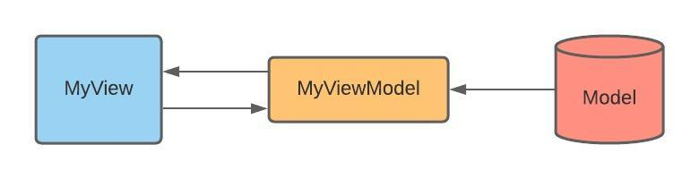
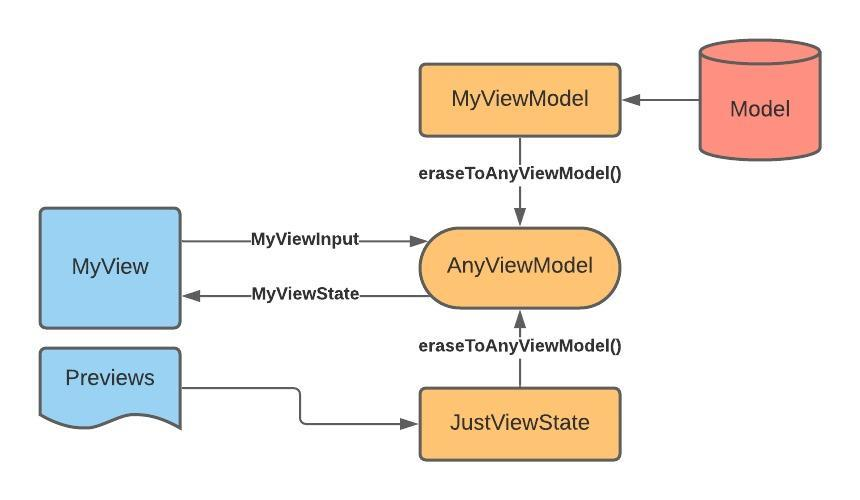

# Combine-ify MVVM with SwiftUI

SwiftUI with Combine offers a powerful way to structure mobile apps. To see how, let's first talk about MVVM.

## What is MVVM?

MVVM stands for `Model`, `View`, and `ViewModel`. It's an architectural style like MVC, which uses objects known as view-models to mediate between views and models. The view-model translates the model into a format that can be rendered by the view, and also interprets inputs povided by the view. This allows us to decouple the view from the model entirely, and increases versatility for the views themselves.



With this relationship, `MyView` can call methods on `MyViewModel`, which in turn updates `MyModel` and passes those changes onto `MyView` via data-binding. This is a step in the right direction, but there's still room for improvement. Even if we abstract the model itself, the view is still concretely referencing the view-model. Normally this is fine, but if we abstract the view-model, we can reuse the view for previewing different states, isolated testing, or even entirely different in-app functionality! For this approach, let's take a page out of Combine's book.

## Introducing AnyPublisher

In Combine, a `Publisher` is something that outputs a result after an indeterminate amount of time. An example is `URLSession.DataTaskPublisher`. Below is a comparison between the old and new data tasks. 

```swift
func refresh() {
    let task = URLSession.shared.dataTask(with: URL(string: "https://mysite.com/feed")!) { d, r, e in
        if let data = d {
            self.feed = JSONDecoder().decode(FeedDTO.self, from: data)
        } else if let err = e {
            print(err)
        }
    }
    task.resume()
}

func refreshWithPublisher() {
    self.refreshPublisher?.cancel()
    self.refreshPublisher = URLSession.shared.dataTaskPublisher(for: URL(string: "https://mysite.com/feed")!)
        .map{ $0.data }
        .decode(type: FeedDTO.self, decoder: JSONDecoder())
        .sink(receiveCompletion: { r in
            if case Subscribers.Completion.failure(let err) = r {
                print(err)
            }
        }){ self.feed = $0 }
}
```

By the way, many things can act as publishers, and you're not limited to asynchronous operations. For example: `["a", "b", "c"].publisher.sink{ print($0) }` uses a publisher for an array to print each item sequentially. 

But in addition to all these tools, my favorite is `AnyPublisher<Output, Failure>`. AnyPublisher is an abstraction to use by anyone who doesn't care *who's publishing*, but rather *what's being published*. To put it directly, AnyPublisher is a decorator that exposes intent using generics, and to get this publisher, all you need to to meet the output/failure criteria, then call `.eraseToAnyPublisher()`.

```swift
func isThisTheWay() -> AnyPublisher<Bool, Never> {
    return Just(true).eraseToAnyPublisher()
}
```

By coding to intent, you still get the results you want, but without the concretion.

## Abstracting ViewModel

So just as we can code to intent with publishers, we can code to intent with view-models. After all, the view doesn't care *who* the view-model is, just *what* it provides for the view. To do this, we have each view identity what it's **state** needs are, and what it will provide as **input**. Below is an example of state and input for a view called `FeedView`. As you can see, it requires a title string and (optionally), an array of feed items. Its possible inputs are to reload or select a feed item. It declares this state and input as its intent for its view-model, which it is able to bind to and interact with.

```swift
struct FeedViewState {
    var title: String
    var items: [FeedItemDTO]?
}

enum FeedViewInput {
    case reload
    case select(FeedItemDTO)
}

struct FeedView: View {
    @EnvironmentObject var model: AnyViewModel<FeedViewState, FeedViewInput>
...
}
```

Then a parent can pass a model to this view like so

```swift
FeedView()
    .environmentObject(FeedViewModel(title: "My Feed")
        .eraseToAnyViewModel())
```



Thanks for reading!

## Contact
[Website](http://schelterstudios.com)
[LinkedIn](https://www.linkedin.com/in/schelter/)
